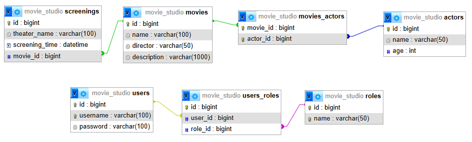

# Movie Studio API

Welcome to the Movie Studio API! This API allows you to manage movies, users, and actors in a movie
studio system. It provides full CRUD functionality for managing movies, users, and actors, and uses
JWT for authentication and authorization. Registered users can be assigned roles such as Admin and
User.

---

## Features

- **JWT Authentication**: Secure authentication using JSON Web Tokens (JWT).
- **User Roles**: Registered users can have either `Admin` or `User` roles.
- **Data management**: Perform CRUD operations on movies, users, and actors.

---

## Authentication

### JWT Authentication

The API uses JWT tokens for authenticating and authorizing users. To access certain resources, a
valid JWT token must be included in the `Authorization` header of each request.

The token is generated when a user logs in or is created, and it should be included in subsequent
requests.

#### Roles

- **Admin**: Can perform all CRUD operations (movies, users, actors).
- **User**: Can only view movies and actors, and perform limited operations.

---

## Database Table Structure

Here is the basic table structure for the Movie Studio API:



---

## RSA Key Generation

To generate RSA key pairs for JWT authentication, use the following commands:

### Generate a Private Key:

```sh
openssl genpkey -algorithm RSA -out src/main/resources/app.key -pkeyopt rsa_keygen_bits:2048
```

### Extract the Public Key:

```sh
openssl rsa -pubout -in src/main/resources/app.key -out src/main/resources/app.pub
```

Ensure that these keys are stored securely and never committed to version control.